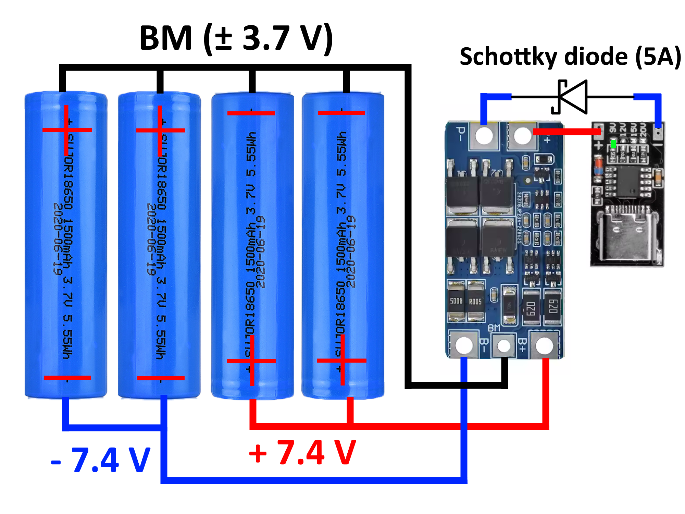
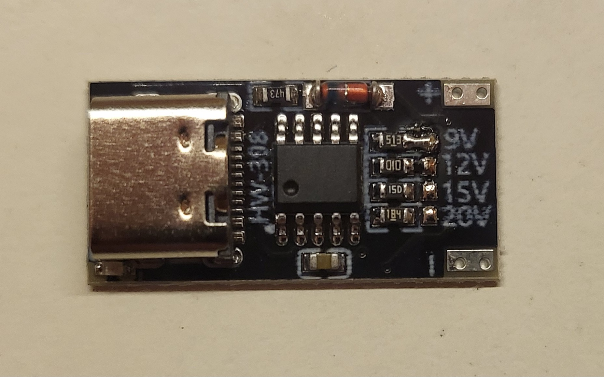
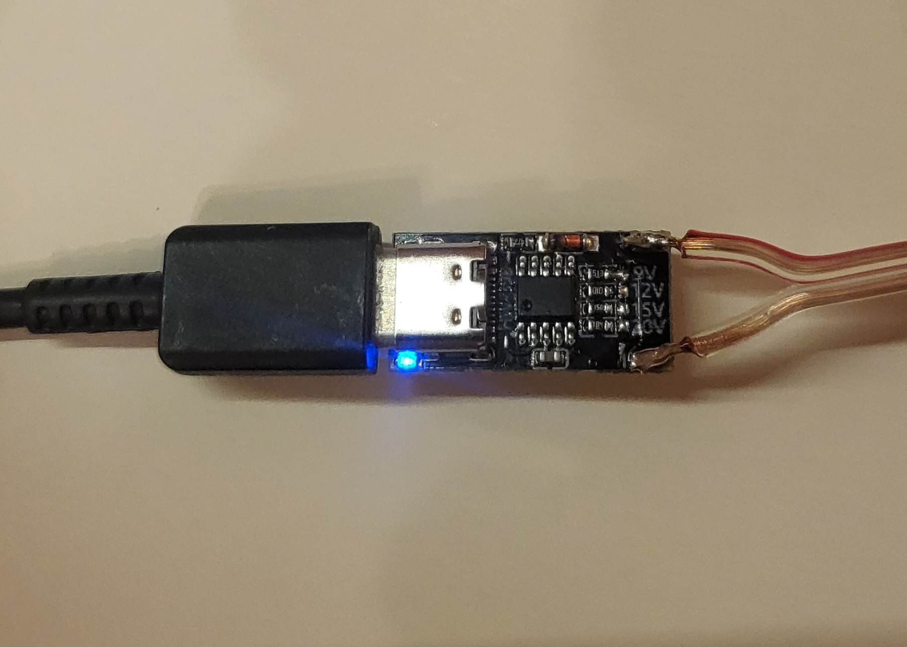
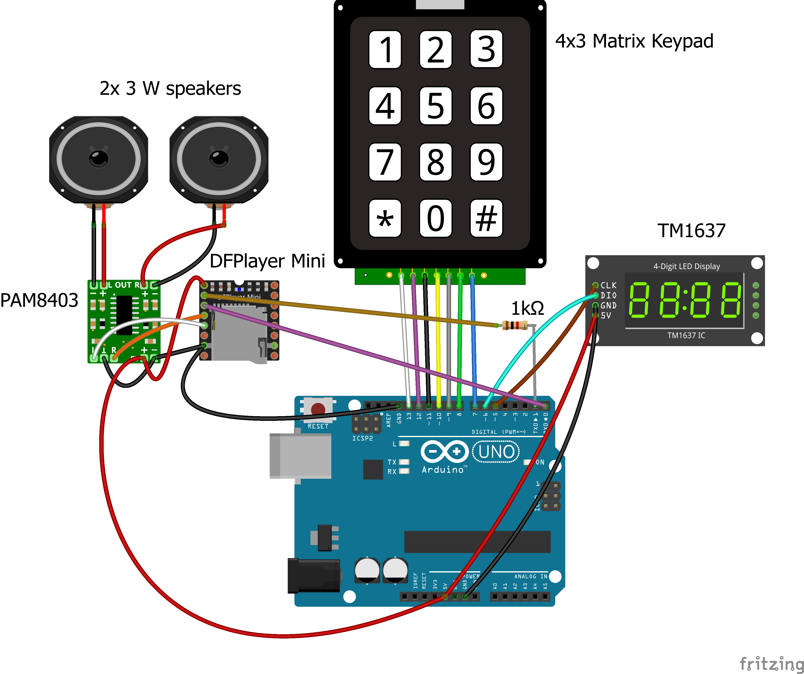

# AirSoftHelper

AirSoftHelper is a work in progress project designed for a local AirSoft team. It is supposed to replicate the visual and auditory functionality of a C4 explosive from the Counter Strike video game.

## Implementation

My iteration is based on Arduino Uno, receiving user input from a matrix keypad and displaying output on a TM1637 display module. In addition, the device uses two 3W drivers and a PAM8403 amplifier for audio feedback.

# Build

Keep in mind, that this was built under home conditions with common hand tools and materials.

## Power

I started off by taking apart 4 old powerbanks to harvest their 18650 cells.

After that, I measured their voltages with a multimeter to make sure they are not below their cut-off voltage and will still work (In my case, they were 3.7 V cells).

In terms of the cell arrangement, I chose to go with 2S2P (2 parallely connected packs of 2 cells connected in series), as it will supply around 7.4V, which is the voltage all used components can operate at.

As for the charging and battery management, I will be using an HX-2S BMS board. The datasheet of this module requires us to place a Schottky diode on the input terminals, so that it directs the flow of current towards the charger and prevents voltage leak from the cells (I used one rated for 5 A, choose yours according to your adapter).

In addition, a USB-C PowerDelivery dummy board will be serving as a trigger board, ensuring that any USB-C adapter can be used to charge the pack. To determine the voltage it will request from the charger, short the pads on the board corresponding to the desired voltage (The BMS board used in this project recommends using 9 V as charging voltage).

### Finished connection

Based on the afore-mentioned conditions, I designed this block schematic:

## Making the battery pack

I first removed the already attached metal strips, sanded the terminal points evenly and cleaned them with isopropyl alcohol.

Then, I arranged the cells based on my sketch, trimmed new nickel welding strips to size and started spot-welding the cells.

After they were connected, I used electrical tape to secure the cells in place and insulated the exposed ends of the pack, while leaving the needed contacts uncovered (± 7.4 V; 3.7 V - BMS).

At this stage, I wired up the battery pack by the schematic:

To finish the power section of the device, I added a backlit switch, which I modified to have an LED rather than a neon indicator light. Additionally, I mounted a 2 way terminal block for easy disconnection.

## Electronics

Based on the datasheets of the components, I designed this diagram:

To test everything, I first assembled the device on a breadboard:

Status: waiting for the MP3 DFPlayer Mini to arrive

## Assembly

I bought a clear plastic container with a lid, originally intended for food storage, that would suit the layout of the device.

Next, I sketched the layout of the components onto the lid and cut it out with an exacto knife. For the speakers, I drilled a set of 1.5 mm holes into the plastic to form a mesh.

This is what the device looks like now, with all the components in place and the switch turned on:

## Code

So far, I have tested the modules with a simple program that requests user input for code and time by displaying a message "CODE", then waiting for a 4-digit keypad input and by displaying a message "TIME", then waiting for a 4-digit keypad input. The inputted digits are immediately shown on the display (when entering time, the colon symbol lights up). 

I am currently waiting for the MP3 DFPlayer Mini to arrive, so that I can continue with further development.